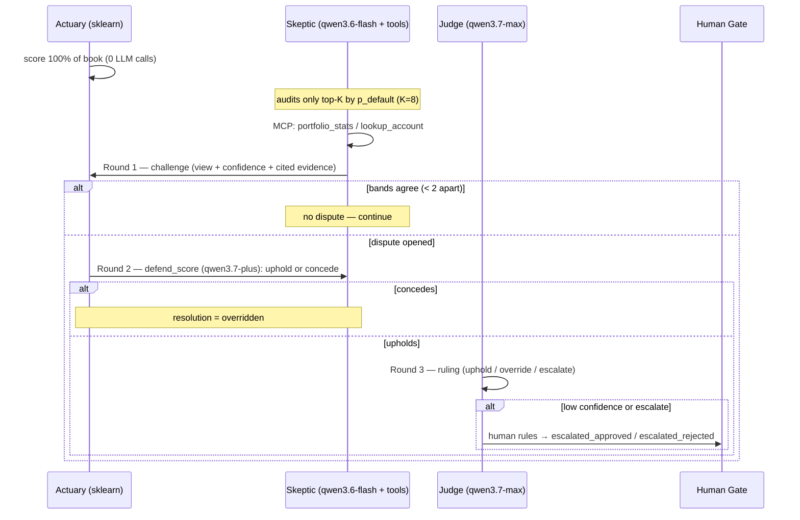
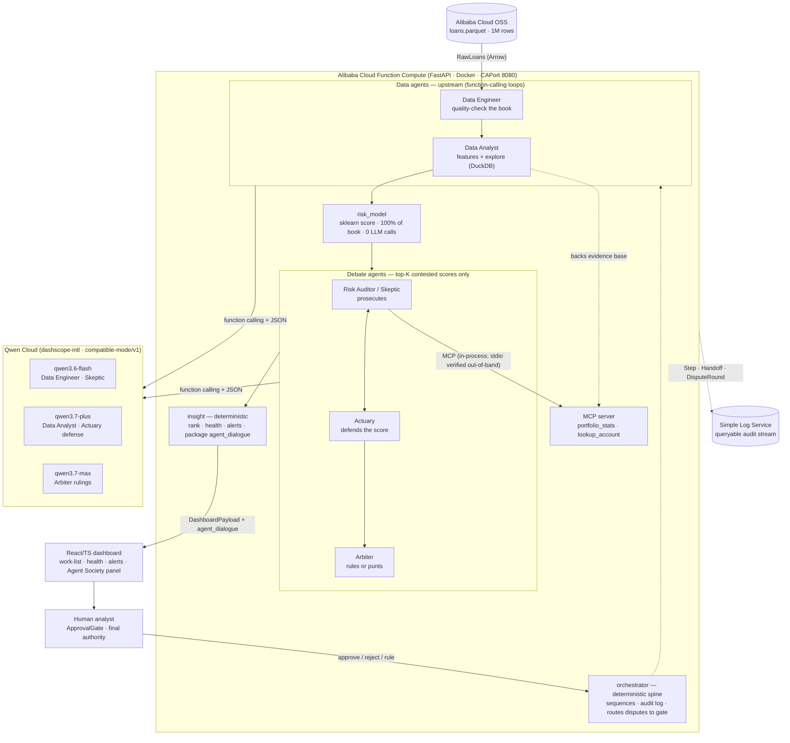

# HACKATHON.md — WASPADA · Agent Society for Loan-Risk Decisions

**Competition:** Global AI Hackathon with Qwen Cloud (Devpost) ·
**Track 3: Agent Society** · submission due **2026-07-09, 05:00 WIB**.
**Live app:** deployed on Alibaba Cloud Function Compute (URL lands with WA-018).
*(Prior Gen AI Academy APAC framing is retired — this file is the new north star.)*

**WASPADA** (Indonesian: *vigilant / on alert*) = **W**arning **&** **A**pproval
**S**ystem for **P**ortfolio **A**nd **D**efault **A**nalytics — a society of
specialized AI agents that scores a multifinance lender's loan book, **argues
about the riskiest calls**, resolves its own disagreements, and hands a human
analyst a defensible collections work-list. Built **by** our own AI company
(Stefanie · Bimo · Kirana · Reza) — *agents building an agent society, humans
holding the gate at both layers.*

---

**Status legend:** ✅ shipped & tested offline · 🟡 architected / planned (not yet in code). Markers reflect the repo at review time.

## Track 3 requirements → how WASPADA answers

> *"Design a multi-agent collaboration system where multiple Agents with
> distinct capabilities work together through task division, dialogue, and
> negotiation... showcase how Agents decompose tasks and assign roles, how they
> resolve disagreements and execution conflicts, and a measurable efficiency
> gain over single-agent baselines."*

| Track ask | WASPADA answer |
|---|---|
| Task division & roles | a deterministic **spine** (orchestrate/package) hosts a **6-member society** (§ two tiers): two **data agents** (quality-check the book, explore/build features) + three **debate agents** + a human — LLM cognition spent where judgment lives (which checks/queries to run, which scores to contest), never on plumbing |
| Dialogue & negotiation | The **risk debate**: Skeptic challenges → Actuary defends → Judge rules — a bounded 3-round argument per contested account, every claim citing evidence (§ debate protocol) |
| Disagreement resolution | Four terminal resolutions (`upheld / overridden / escalated_approved / escalated_rejected`), an Arbiter ruling tier, and a human `ApprovalGate` as the constitutional backstop |
| Efficiency gain vs single agent | Measured head-to-head: one-LLM-call-per-account baseline vs. the society (deterministic model on 100% + bounded LLM audit on top-K) — recall/precision @ call-tier, LLM-calls-per-account, latency (§ benchmark) |

## Judging rubric → design mapping

**Technical Depth & Engineering (sophisticated QwenCloud API use):**
- ✅ · **Native function calling** — the Skeptic runs a real Qwen tool-calling loop
  (`tools`/`tool_calls`, confirmed supported on all three models we use); *Qwen
  decides* when to pull portfolio context via the `portfolio_stats` and
  `lookup_account` tool schemas (declared natively in the `tools` parameter), not
  hard-wired Python. The results are fed back as `tool`-role messages so the
  model's final verdict is grounded in real evidence. JSON-mode parsing is kept
  as a fallback (if `tool_calls` is empty, content is parsed as JSON — never crashes).
- ✅ · **MCP integration** — a real MCP server (`waspada/mcp/`) serves
  `portfolio_stats` + `lookup_account` over the Model Context Protocol; agents
  consume it through an MCP client session. Stretch: expose it over SSE on
  Function Compute and attach it natively to Qwen's **Responses API**
  (`{"type":"mcp", "server_protocol":"sse", ...}` — confirmed platform feature).
- ✅ · **Model tiering by cognitive load** — `qwen3.6-flash` (cheap triage
  challenges) → `qwen3.7-plus` (rebuttals) → `qwen3.7-max` (arbiter rulings).
- ✅ · **JSON-mode + validate-and-retry** — `response_format: json_object`
  (confirmed; strict `json_schema` is *not* offered) with schema validation and
  one retry, degrading gracefully (never crashes the pipeline).
- Honest note: Qwen Cloud has **no server-side "custom skills" API primitive**
  (that's a Qwen Code CLI feature). Our equivalent is the **agent skill card**
  (§ roster) — a per-agent capability contract in code + docs. We claim exactly
  what exists: function calling, MCP, JSON mode, tiering, streaming.

**Innovation & AI Creativity (architecture quality):**
- Adversarial **debate protocol with a deterministic cost ceiling** (≤ K×3
  debate *rounds*, K=8 default; the challenge round is itself a bounded native
  tool-calling loop, so ≤ K×6 LLM calls worst case) — negotiation without
  unbounded agent chatter.
- **Evidence-grounded claims** — a debate turn must cite feature values /
  portfolio stats (pulled via MCP) or it's discounted; claims are data, not vibes.
- `DISPUTED` as a **first-class pipeline state** (alongside ok/blocked/error) —
  disagreement is modeled in the protocol, not bolted on.
- **Graceful degradation everywhere**: mock brain by default (offline CI),
  unparsable LLM replies → logged + safe fallback, gate fails closed, frozen
  data contract validated at every seam. 324-test suite stays green offline.

**Problem Value & Impact:** real multifinance collections pain (stale manual
work-lists → NPL losses); the society pattern generalizes to any
score-then-contest decision (the origination lane runs on it too — WA-033..039). **Alibaba
Cloud native — 5 services:** OSS (portfolio store) + Function Compute (backend)
+ ApsaraDB RDS MySQL (auth) + Container Registry/ACR (image builds) + Qwen Cloud
(reasoning) + Simple Log Service (queryable audit stream of every
agent turn — the "show me the audit trail" answer for a regulated lender).

**Presentation & Documentation:** the dashboard's **Agent Society panel**
renders the debate itself — who challenged, what evidence, who conceded, what
the human ruled (§ UI). Architecture diagram below; 3-min demo script in
`demo.md`.

---

## The real user & problem (unchanged core)

- **User:** a risk/collections **data analyst** at an Indonesian multifinance
  lender (consumer installment financing).
- **Pain:** telling collectors **which accounts to chase today** means grinding
  millions of rows in pandas/SQL/Excel — the work-list is stale on arrival, and
  a pure-ML score gives no *argument* an analyst can defend to the collections
  head.
- **What WASPADA adds over a score:** the riskiest calls arrive **pre-argued**
  — challenged, defended, ruled — with the transcript attached. The analyst
  approves a *decision with reasons*, not a number.

## Two tiers — a deterministic harness hosting an agent society

We're deliberate about a distinction most "multi-agent" projects blur: **the
harness is not the society.** The reproducible plumbing that fetches, sequences,
computes, and packages is a **deterministic runtime** — it hosts the agents, it
isn't one. The **society** is the set of participants that exercise real LLM
judgment: two **data agents** that reason over the book (a **Data Engineer**
choosing which quality checks to run, a **Data Analyst** choosing which queries
to explore), and the **debate** — an LLM that prosecutes a score, an LLM that
defends it, an LLM that judges, and a human who holds final authority. What
stays deterministic is the *plumbing*: sequencing, the actual arithmetic, the
packaging. Naming this line is the point — it's the "cheapest sufficient
intelligence per component" discipline, and it preempts agent-washing: we don't
call an OSS fetch or a `GROUP BY` an "agent" — we call the *decision of which
check or query to run next* one.

The one thing genuinely uncommon here: **the object under debate is a
calibrated classical-ML score with real feature evidence, not a free-text
answer.** Both debaters are LLMs (one prosecuting, one defending the model's
number); the *defendant* is the logistic-regression output — a number can't
argue for itself, so an LLM is assigned as its defense counsel.

### Tier 1 — the harness (deterministic runtime, single outer pass, no cognitive loop)

| Component | Function | Mechanism | Tools / capability | On failure |
|---|---|---|---|---|
| `orchestrator` | Plans, sequences, records every `Handoff`/`Step`, routes disputes to the gate | **rule-based** control flow (the spine never hallucinates) | gate wiring, audit log | halt loudly, partial audit trail preserved |
| `insight` | Ranks the work-list, computes health, raises alerts, packages the transcript | **rule-based** (ranking + alert thresholds) | ranking/alerts, `agent_dialogue` assembly, requests gate approval | gate rejection → `blocked` |

The **deterministic compute** the data agents drive — the OSS fetch + freshness/
schema gate, the feature arithmetic and DPD/vintage bucketing — lives *inside*
the Data Engineer and Data Analyst as their reproducible core (Tier 2). The LLM
layer only decides *which* check or query to run; the numbers themselves are
never LLM-generated.

### Tier 2 — the agent society (data + debate participants; cognition and the function-calling loops live here)

The society runs in two groups, in sequence: **data agents** (upstream — get the
book trustworthy and feature-rich) then **debate agents** (downstream — contest
the scores).

| Participant | Role | Brain | Capability | On failure |
|---|---|---|---|---|
| `data_engineer` | ✅ · **The Data Engineer** — validates, profiles, and quality-checks the freshly-loaded book before anyone trusts it | **LLM** (`qwen3.6-flash`) + **function-calling loop** over a deterministic DuckDB check core | tools: `validate_schema`, `null_rates`, `profile_column`, `detect_anomalies` | dirty data → `blocked`; unparsable tool step → run the default check set (validation never skipped) |
| `data_analyst` | 🟡 (planned, WA-030 — analytics is deterministic today) · **The Data Analyst** — builds features and explores the book for the aggregates the debate later cites | **LLM** (`qwen3.7-plus`) + **function-calling loop** over DuckDB SQL | tools: `query`, `correlation`, `distribution`, `build_feature`; backs the MCP evidence base | tool/parse failure → fall back to the fixed, deterministic feature recipe |
| `risk_model` (score) | ✅ · **The Defendant + Counsel** — a classical-ML score, defended by an LLM when challenged | **classical ML** (sklearn LogisticRegression) as the score; `qwen3.7-plus` as its defense voice (`defend_score()`) | vintage-split training, leakage guard; uphold-or-concede rebuttal | unparsable rebuttal → auto-escalate |
| `risk_auditor` | ✅ (note: single-shot JSON, not a loop) · **The Prosecutor (Skeptic)** — audits the top-K riskiest scores, challenges where the story doesn't match the number | **LLM** (`qwen3.6-flash`) + **native function-calling loop** | **MCP client**: `portfolio_stats`, `lookup_account`; opens `Dispute`s with cited evidence | unparsable challenge → no dispute (logged), pipeline continues |
| `arbiter` | ✅ · **The Judge** — reads both arguments, rules, or punts to the human | **LLM** (`qwen3.7-max`) | ruling with rationale + confidence; low confidence → escalate | unparsable ruling → escalate to human |
| *(human analyst)* | ✅ · **The Gate (final authority)** — ratifies overrides, rules escalations | **human** | `ApprovalGate` (`resolve_risk_dispute`, `publish_work_list`); auto-approve logged `auto=True`, distinguishable in audit | fails **closed** (no decide channel → rejected) |

**Where the loops are:** three, all function-calling — the Data Engineer, the
Data Analyst, and the Prosecutor each Think→Act→Observe (decide which tool →
observe the result → decide whether to call again → conclude). The harness spine
runs a single outer pass with one branch (dispute → gate); the Judge and Defense
are single-shot LLM turns, not loops. Loops live only where iterative,
tool-driven reasoning is actually needed — never in the spine.

## The debate protocol (bounded negotiation)



- **Cost ceiling is deterministic:** ≤ K×3 debate *rounds* (K challenge + at
  most K rebuttals + at most K rulings). Each challenge is a bounded native
  tool-calling loop (≤4 turns), so the worst-case LLM-call count is ≤ K×6;
  typical runs far less. No open-ended agent chatter.
- Every LLM turn returns **JSON-mode** output parsed into a `DisputeRound`;
  parse failure at any round degrades safely (see skill cards).
- The pipeline result while a dispute is live is `Status.DISPUTED`; the
  orchestrator routes it to the gate action `resolve_risk_dispute` (distinct in
  the audit log from `publish_work_list`).

### Dispute record — frozen serialization (backend must emit exactly this)

`waspada/agents/protocol.py` already ships `Dispute`/`DisputeRound`;
**additive fields to implement**: `model` + `evidence` on `DisputeRound`;
`model_band` + `auditor_view` on `Dispute`. Serialized into
`DashboardPayload.agent_dialogue` (additive optional key — frontend types +
fixture already updated to this exact shape):

```json
{
  "loan_id": "LN00961668",
  "opened_by": "risk_auditor",
  "model_band": "Very High",
  "auditor_view": "Medium",
  "rounds": [
    {"round_no": 1, "speaker": "risk_auditor", "model": "qwen3.6-flash",
     "claim": "...", "confidence": 0.72,
     "evidence": ["payment_ratio=0.61 vs Very High median 0.18"]},
    {"round_no": 2, "speaker": "risk_model", "model": "qwen3.7-plus",
     "claim": "...", "confidence": 0.84, "evidence": ["dti=31.4 (p95)"]},
    {"round_no": 3, "speaker": "arbiter", "model": "qwen3.7-max",
     "claim": "...", "confidence": 0.9, "evidence": []}
  ],
  "resolution": "upheld",
  "resolved_by": "arbiter",
  "rationale": "..."
}
```

`resolution` ∈ `upheld | overridden | escalated_approved | escalated_rejected` ·
`resolved_by` ∈ `risk_model` (conceded) `| arbiter | human`.

## Prior art & the novelty claim (be precise — judges are read-in)

We stand on known shoulders and say so: **Multi-Agent Debate** (Du et al.,
arXiv 2305.14325 — symmetric LLM-vs-LLM rounds), **AI Safety via Debate**
(Irving et al., arXiv 1805.00899 — two arguers + a judge), **prover–verifier
games** (asymmetric roles), and LLM-as-judge. What we claim as fresh is the
**conjunction**, not the parts:

1. the *defendant is a deterministic, calibrated ML model* — the debate is
   about a numeric risk score, not free text;
2. a dispute is *admissible only with cited evidence pulled live* from the
   actual loan book via MCP tools (not a static corpus);
3. the loop runs under a *fixed, pre-declared call budget* with a *human
   constitutional backstop* for the unresolved tail.

Explicitly **not** claimed as novel: bounded rounds (standard in the debate
literature — ours is a *cost-predictability/production* property) and
human-in-the-loop escalation (established — ours is a *governance
completeness* property). Over-claiming loses Technical Depth credibility;
the write-up and video use exactly this framing.

## Architecture



- **Error handling story** (rubric: "strong error handling"): frozen contract
  validated at every hand-off (drift fails loud); LLM replies JSON-validated
  with one retry then safe fallback; gate fails closed; `blocked/error/disputed`
  are distinct terminal states; every step and handoff is audit-logged; the
  whole system runs offline on `MockLLM` (CI proves it — 131 tests, no network).
- ✅ (WA-023: `waspada/audit/` ships the step log to SLS with a fail-safe local-file fallback) · **Audit stream (SLS):** every `Step`/`Handoff`/`DisputeRound` is also shipped
  to **Alibaba Simple Log Service** as structured logs (`run_id, agent, action,
  model, tokens, latency, resolution`) — SQL-queryable in the SLS console.
  ~2h integration (`aliyun-log-python-sdk`, one thin wrapper on the
  orchestrator's existing step log); free tier covers demo volume. Failure-safe:
  SLS unavailable → log locally, never block the pipeline.
- **CloudMonitor:** FC invocations/duration/errors dashboards are automatic —
  zero build; screenshot goes in the deployment-proof recording.
- **Modularity/scalability:** lane-agnostic agent substrate (origination =
  same society, different features/label); OSS object swap scales the book;
  FC scales the backend; K and model tiers are config.

## Lakehouse data layer (WA-029/030 · re-scoped by WA-047)

**Architecture decision (2026-07-14): the lakehouse is OSS + DuckDB. Nothing
else.** RDS MySQL is the operational **auth** store (WA-028) and is *not*
part of the lakehouse; DuckDB↔RDS federation is **descoped, not deferred**.

Honest status — today this is a **data lake read**, not yet a lakehouse (no
table format, no versioning, no snapshot isolation). WA-047 closes the gap.

- ✅ · **OSS (data lake):** `loans.parquet` (33 MB · 1M rows) is the source of
  truth in Alibaba Cloud OSS, read via `oss2`.
  🟡 A partitioned layout (`raw/lane={lane}/as_of={date}/…`) giving versioning,
  lane separation and lineage — WA-047. Today it is a single flat object at
  `OSS_KEY`, and **nothing writes to the bucket** (the RAM policy is read-only).
- ✅ · **DuckDB (query engine):** the in-process SQL engine the data agents run
  SQL against — `SELECT grade, avg(dti) ... GROUP BY grade` instead of Python
  aggregation.
  🟡 **Remote pushdown is not wired.** Today `oss.py` downloads the whole object
  and the agents register it as an in-memory Arrow table (`_arrow_lakehouse`),
  so DuckDB never queries OSS directly. `httpfs` / `read_parquet('s3://…')` —
  WA-047.
- 🟡 · **dlt pipeline** (schema contracts, incremental cursors, `merge` dedup on
  `loan_id`, `load_info` audit metadata): **not implemented — and no longer
  pretended.** The earlier `waspada/data/lakehouse.py` dlt path was dead code
  with two defects (`dlt.readers.filesystem` does not exist; the loaded data
  never landed in the returned connection) and was never called; it was
  **removed** (WA-047). Today `load_to_duckdb` honestly registers the
  Arrow table that `oss.py` bulk-reads. Genuine OSS pushdown via `httpfs` is
  future work. The schema contract that *does* exist is the Python
  `validate_table(raw, RawLoans)` gate inside the Data Engineer.
- ✅ · **RDS MySQL — auth only** (WA-028). *Not* a lakehouse component.
  **Dispute memory lives in OSS**, not RDS (`memory/disputes/loan_id={id}.json`
  — see WA-046, which also fixes the bug that no entrypoint currently wires a
  persistent memory backend at all). The audit trail goes to **SLS** (WA-023),
  with OSS as the planned cold tier.

Two pipeline agents become **AI agents** powered by Qwen function calling:
- ✅ · **Data Engineer** (qwen3.6-flash) — validates, profiles, quality-checks the
  snapshot. Decides which checks to run via tool-calling loop
  (validate_schema → null_rates → profile_column → detect_anomalies).
- 🟡 · **Data Analyst** (qwen3.7-plus) — builds features, explores the data,
  surfaces insights. Runs DuckDB SQL via function calling (query →
  correlation → distribution → build_feature).

Both use the same Qwen native function-calling loop as the Risk Auditor —
multi-hop tool calls where Qwen decides which query to run next. This is
genuine AI-powered analytics: the agents reason about what to explore, they
don't execute a fixed script.

## Analytics (feeds the debate — not a separate showpiece)

The Data Analyst's feature pipeline (payment ratios, DPD buckets, vintage
cohorts, segment health) is both the **model's input** and the **debate's
evidence base**: the MCP tools serve exactly these aggregates, so what an agent
*cites* is what the pipeline *computed*. Optional cuDF/WSL GPU path exists for feature
engineering (kept; benchmark harness removed as out of scope for this track).

**Expected Loss (WA-024 — the most credit-credible number we can show):**
per-account and portfolio **EL = PD × LGD × EAD**, with assumptions *labeled
on-screen*: LGD = 45% flat (Basel foundation-IRB benchmark for unsecured
consumer credit), EAD = `outstanding_principal` (defensible for amortizing
installment loans — no revolving/undrawn component). PD is the model's
`p_default`. This turns the work-list from "risky accounts" into "rupiah at
risk," which is how a risk committee actually ranks work.
**Honesty rails (verified against our cross-sectional snapshot):** vintage
default rate by cohort and status mix are computable and already shipped;
**cure rates and true band migration are NOT computable** from one snapshot —
do not fake them. Stretch-if-time: EL-weighted product×region heat-map + HHI
concentration metric (both computable, ~2h combined).

## Efficiency benchmark (Track 3's "measurable gain")

`waspada/bench-society/` (new) — same honesty discipline as the removed GPU
harness (a stage that didn't run reports `not_run`, never a faked number):

| | Single-agent baseline | Agent Society |
|---|---|---|
| Method | one `qwen3.7-plus` call per test account, raw features in, band+action out | sklearn scores 100%; Skeptic/Judge audit top-K only |
| Test slice | the existing vintage hold-out split (real `label_default` ground truth) | same slice, same labels |
| Report | recall@call-tier · precision@call-tier · **LLM calls per account** (≈1.0) · wall-clock P50/P95 | same metrics (LLM calls ≈ K×≤3 / N ≈ 0.1–0.4) + **escalation rate** (human-review load) |

**Presentation format (what makes efficiency claims believed):**
- **One hero number**, stated up front — target shape: *"matches the
  baseline's top-tier recall at ~⅛ the LLM calls per account."* Whatever the
  real run produces is the number — measured, never rounded up.
- **Cost per caught high-risk account** (cost normalized by *success*, not by
  call volume) — the honest denominator.
- **Cost–quality frontier:** recall@call-tier (y) vs LLM-calls-per-account (x),
  sweeping K ∈ {4, 8, 16}; baseline and WASPADA as points on the same axes.
  One chart answers "is the extra machinery worth it?"
- **Escalation rate** as a governance metric: how much human-review load the
  society actually generates (a lender cares about this as much as recall).
- **State the honest negative:** multi-agent is *not* worth it for cheap,
  low-stakes decisions — loan-risk qualifies because each decision is
  high-value and tool-grounded. Naming the boundary is a credibility feature.

Committed snapshot: `bench-society/AGENT_SOCIETY_BENCH.json` (a stage that
didn't run reports `not_run` — never a fabricated number). Stretch-if-time
(WA-025): a 3-row ablation — full society vs no-Skeptic vs
no-evidence-requirement — the strongest possible "every agent earns its place"
artifact for the Innovation axis.

## UI — the Agent Society panel (high-value demo surface)

`dashboard/src/components/AgentDialogue.tsx` (shipped, fixture-driven): a
full-width panel under the main grid rendering `agent_dialogue` — per-dispute
cards with the Actuary-vs-Skeptic band clash, the round-by-round transcript
(speaker chip · model tag · claim · confidence · cited-evidence pills), and a
resolution badge (`Upheld / Overridden / Escalated`). Works today against the
extended fixture; switches to real Qwen transcripts the moment the backend
emits `agent_dialogue` (WA-014) — same frozen shape. Stretch (WA-022): a "Run
live" button on `/api/run?brain=qwen` with SSE streaming so judges watch the
debate happen.

## Build plan — tickets (Stefanie owns creation/priority; suggested split)

Done (co-builder, 2026-07-07): LICENSE · `QwenLLM` (+`get_llm` wired into CLI &
API, `?brain=qwen` opt-in) · OSS data layer ·
`Status.DISPUTED` + `Dispute`/`DisputeRound` in protocol · GPU benchmark
removed · README/HACKATHON rewritten · AgentDialogue panel + types + fixture.

**Core (must land, in order):**
- **WA-014** (Bimo · P0) — `RiskAuditorAgent` challenge round (flash + function
  calling), dispute wiring, orchestrator `DISPUTED` branch +
  `resolve_risk_dispute` gate action, `agent_dialogue` into the payload
  (ranking kwarg + insight threading), additive `DisputeRound.model/evidence` +
  `Dispute.model_band/auditor_view` fields, API step-collection fix.
- **WA-015** (Bimo · P0) — MCP server `waspada/mcp/` (`portfolio_stats`,
  `lookup_account`) + client session; register as the Skeptic's tools (same
  `register_tool` pattern as ingest's `fetch` → stubbable in tests).
- **WA-016** (Bimo · P1) — `defend_score()` rebuttal (plus) + `ArbiterAgent`
  ruling (max). **Cut line:** if time runs out, skip the arbiter — an upheld
  rebuttal escalates straight to the human gate. Still a complete story.
- **WA-017** (Bimo · P1) — efficiency benchmark + committed JSON.
- **WA-018** (owner + Bimo · P0) — ✅ **SHIPPED 2026-07-18.** Function Compute
  deploy: AMD64 build → ACR push → FC custom container (CAPort **8080**) →
  HTTP trigger → public URL:
  `https://waspadaprod-api-vouqzqqkiu.ap-southeast-1.fcapp.run`
  (`/api/health` → `{"status":"ok"}`). Note: the `*.fcapp.run` test domain
  forces `Content-Disposition: attachment` on `text/html` (platform anti-abuse),
  so the dashboard `/` route downloads instead of rendering — demo the UI
  locally against the deployed API; all `/api/*` routes serve inline. Custom
  domain fix = WA-067 (post-hackathon).
- **WA-019** (Kirana · P1) — polish AgentDialogue (first cut is in), wire a
  "Run live (Qwen)" action against `/api/run?brain=qwen` with a loading state.
- **WA-020** (Reza · P1) — QA the debate: scripted-`MockLLM` dispute tests
  (open/concede/uphold/escalate paths), parse-degradation cases, **secrets
  sweep before the repo goes public** (`.env`, `secrets/`, deck files).
- **WA-023** (Bimo · P1 · ~2h) — SLS audit stream: `aliyun-log-python-sdk`,
  thin wrapper on the orchestrator step log, fields
  `run_id/agent/action/model/tokens/latency/resolution`; fail-safe (SLS down →
  local log only). Needs owner's Alibaba AccessKey (same pair as OSS).
- **WA-024** (Bimo backend + Kirana display · P1 · ~2h) — Expected Loss:
  per-account `expected_loss = p_default × 0.45 × outstanding_principal` into
  the payload (additive), portfolio EL in `portfolio_health`, assumptions
  labeled in the UI.

**Data agents (the lakehouse upgrade — § Lakehouse data layer):**
- **WA-029** (Bimo · P1) — **Data Engineer agent**: OSS-Parquet load into in-process DuckDB + a frozen schema
  contract on the OSS Parquet, wrapped by a `qwen3.6-flash` function-calling loop
  over quality tools (`validate_schema`/`null_rates`/`profile_column`/
  `detect_anomalies`). Keeps the existing deterministic freshness/schema gate as
  its core (never removes it); same `register_tool` pattern as ingest's `fetch`
  → stubbable in tests. Promotes `ingest` from Tier 1 to a Tier-2 data agent.
- **WA-030** (Bimo · P1) — **Data Analyst agent**: DuckDB query engine over the
  Parquet, driven by a `qwen3.7-plus` function-calling loop
  (`query`/`correlation`/`distribution`/`build_feature`). Falls back to the fixed,
  deterministic feature recipe on any tool/parse failure; the aggregates it
  computes back the MCP evidence base (§ Analytics). Promotes `analytics` to a
  Tier-2 data agent.

**Stretch (only after core):**
- **WA-021** — MCP over SSE on FC + native Responses-API attachment (the
  `{"type":"mcp"}` tools block) — the strongest possible rubric hit if it fits.
- **WA-022** — SSE-streamed live debate in the UI.
- **WA-025** — 3-row ablation for the benchmark (full / no-Skeptic /
  no-evidence-requirement).
- **WA-026 — cross-run dispute memory (institutional memory, not
  self-improvement).** *Dependency-gated, not time-gated:* the society can't
  remember disputes until disputes exist (needs WA-014 + WA-015 running
  end-to-end) — that's the only reason it's sequenced after core, not a
  triage cut. Design: resolved disputes persisted to **OSS** (`disputes/`
  index, keyed by `loan_id`; a daily collections run re-scores the same book,
  so `loan_id` recurrence is real, not contrived). On a new run the
  Orchestrator checks memory *before* opening a debate: a prior **human**
  ruling on the same account is injected as context (the Arbiter/Skeptic see
  precedent) or short-circuits an already-settled case. **Honest framing:**
  this is *decision consistency + institutional memory* (falling human-review
  load, precedent applied consistently — what a lender actually wants), NOT
  the model getting smarter — do not claim self-improvement. **Second
  efficiency axis:** run the same book twice → run 2 spends measurably fewer
  LLM calls + fewer escalations. **Demo design (load-bearing):** stage it as
  run-1 (full debate, judges see the argument) → run-2 (memory kicks in,
  fewer calls) — the memory must *inform/accelerate*, never silence the debate
  the judges came to see. Crosses over to the hackathon's MemoryAgent track
  theme. ~3–4h. If it lands, it's a headline feature, not a footnote.
- EL-weighted product×region heat-map + HHI concentration (fold into WA-024
  only if its core lands early).

**Next-phase roadmap (🟡 requirements frozen 2026-07-12, not started — full
specs in `backlog/WA-032..039`):**
- **WA-032 — Human-configurable decision matrix (`RiskPolicy`).** The band→action
  map (`ACTION_BY_BAND`), alert thresholds, and NPL buckets move from hard-coded
  constants in `insight/ranking.py` into a committed, validated JSON policy file
  (`WASPADA_POLICY_FILE`); defaults preserve today's behavior byte-for-byte.
  Analysts edit policy without touching code. Land this first — it is also the
  Origination lane's action-matrix machinery.
- **WA-033–039 — the Origination lane** (approve / refer / reject new
  applications on the same engine and Agent Society) — **LANDED**, no longer a
  stretch: `python -m waspada.agents --lane origination` runs the full society
  end-to-end offline. The substrate was already
  lane-agnostic (config lanes, protocol, gate, the whole debate engine); the
  build is additive: application-time contract types (WA-034) → 
  `features/origination.py` with a funded-then-defaulted label (WA-035; no
  reject-inference — the source only has funded loans, stated honestly) →
  lane-parameterized model features + application-cohort OOT split (WA-036) →
  `insight/origination.py` decision matrix as a `RiskPolicy` + approval-rate/EL
  health (WA-037) → lane-aware data agents + OSS source (WA-038) → dashboard
  approve/refer/reject badges + origination health panel, EN/中文 (WA-039).
  The guard (`orchestrator.plan()`'s "Origination deferred" raise) is lifted;
  the Skeptic⇄Actuary→Arbiter debate contests the riskiest decisions unchanged
  (an id alias keeps the whole debate machinery lane-agnostic).

**Loop note (design principle, not a ticket):** the LLM agents already loop —
native function calling *is* Think→Act→Observe (the Data Engineer, Data Analyst,
and Skeptic each call a tool, see the result, decide whether to call again, then
answer). The deterministic spine (orchestrator, insight packaging) and the
single-shot turns (the sklearn score + its defense, the Arbiter ruling)
**deliberately do not loop or self-modify** — reproducibility + auditability is
the governance property that wins Problem Value; an agent that rewrites its own
logic mid-run would break it. Loops live where judgment lives, by design.

## Submission checklist (Devpost)

- [ ] Public GitHub repo, **LICENSE visible in About** (MIT — done, needs push)
- [ ] Proof of Alibaba Cloud deployment: short screen recording of the FC
      console (**include the auto-generated CloudMonitor metrics view** — free
      credibility) + live URL; link `deploy/fc/` runbook AND
      `waspada/agents/llm.py` (QwenLLM → dashscope-intl) +
      `waspada/data/oss.py` + the SLS logging wrapper as the code-file proof
- [ ] Architecture diagram (above; also render for the deck)
- [ ] ~3-min public video (YouTube) — adapt `demo.md`: lead with the debate
      panel, then the live run, then the benchmark table
- [ ] Text description + **Track 3** identification
- [ ] Optional blog post (prize-eligible) — the *agents building agents* story

## Risks

- **Z.ai/GLM throttle on the builders** — small tickets, off-peak runs.
- **DashScope free-quota burn** — flash-first tiering; `?brain=qwen` opt-in
  keeps the public demo endpoint on mock; benchmark N kept small.
- **JSON-mode ≠ json_schema** — always validate + retry once + degrade; never
  trust raw parse.
- **FC unknowns** (subprocess for stdio MCP inside FC's sandbox unverified) —
  smoke-test early in WA-018; fallback = MCP demo'd locally/CI while FC serves
  the app itself.
- **Time** — the cut lines are pre-agreed (WA-016 arbiter → straight-to-gate;
  WA-021/022 stretch only). The gate, the debate round 1, MCP, the UI panel,
  and the FC deploy are the non-negotiables.
