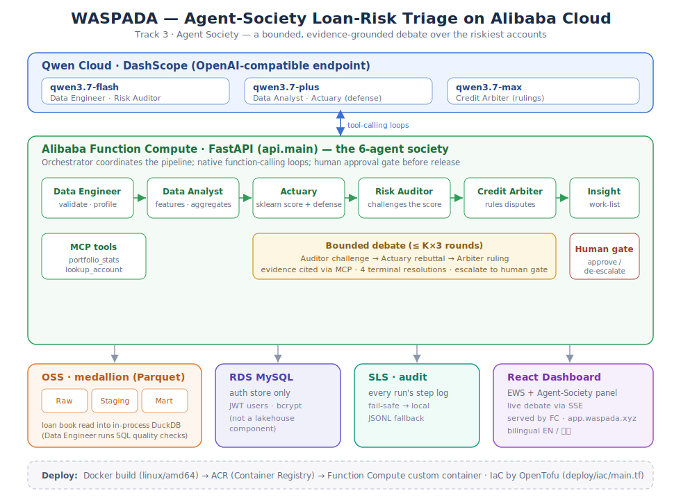
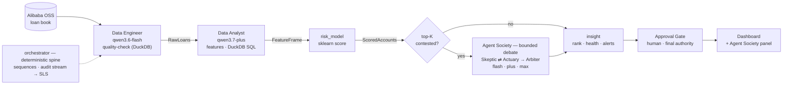

# WASPADA

**W**arning **&** **A**pproval **S**ystem for **P**ortfolio **A**nd **D**efault
**A**nalytics — an autonomous **multi-agent risk decision-support system** for a
multifinance lender's collections analyst.

WASPADA scores a lender's loan book, has a **society of AI agents argue about
the riskiest accounts**, resolves its own disagreements under a bounded call
budget, and hands a human analyst a defensible collections work-list — with the
debate transcript attached. Two decisions on one shared risk engine:

- **Collections / Early-Warning (EWS)** — which existing accounts are about to
  roll into NPL, and how to prioritize limited collector capacity. **Built
  end-to-end** (data agents → model → debate → rank → dashboard, with a human
  approval gate).
- **Origination** — approve / reject / price new applications. Architected as an
  additive second lane (deferred — the substrate is lane-agnostic).

**Stack:** Alibaba Cloud OSS (data lake) · DuckDB (in-process query engine) ·
Qwen models via Alibaba Cloud Model Studio/DashScope (the Agent Society brain,
opt-in) · a multi-agent layer over a mockable LLM (**mock by default, offline**)
· Alibaba Simple Log Service (audit stream) · ApsaraDB RDS MySQL (auth) ·
React/TypeScript dashboard · optional cuDF-on-GPU (WSL2) feature path.

> Built by an autonomous AI software company — Stefanie (PM) · Bimo (backend) ·
> Kirana (frontend) · Reza (QA). Agents building agents, humans on the sign-off
> gate at every layer.

---

## What it does

Every day a collections analyst must tell the team **which accounts to chase and
how to spend limited collector capacity.** Today that means grinding millions of
payment rows in pandas/SQL/Excel — the work-list is stale on arrival, and a pure
ML score gives no *argument* an analyst can defend to the collections head.

WASPADA automates that loop **and attaches the argument**:

1. **Data Engineer** (AI · `qwen3.6-flash`) loads the loan book from OSS and
   reasons over data quality — a function-calling loop that decides which checks
   to run (schema · null rates · anomalies), with a deterministic freshness +
   schema gate as its non-negotiable core.
2. **Data Analyst** (AI · `qwen3.7-plus`) builds features and explores the book
   via DuckDB SQL — a function-calling loop producing the aggregates the debate
   later cites. The `FeatureFrame` itself stays **deterministic** (reproducible).
3. **Risk model** (sklearn) scores default probability per account —
   leakage-guarded, vintage-split.
4. **Risk debate** — the Risk Auditor (Skeptic) challenges the top-K riskiest
   scores; the model's defender (Actuary) upholds or concedes; an Arbiter rules
   or escalates. Every claim cites evidence pulled live via **MCP**.
5. **Insight** ranks the work-list, computes portfolio health, raises cohort
   alerts, and packages the debate transcript.
6. **Human approval gate** — an analyst reviews and releases the work-list
   (fails **closed**).
7. **Dashboard** renders the work-list, health, alerts, and the **Agent Society
   panel** — the debate itself (who challenged, what evidence, who conceded, what
   the human ruled), with a live SSE stream option.

Every `Step` / `Handoff` / `DisputeRound` is shipped to an **audit stream**
(Alibaba Simple Log Service, with a fail-safe local fallback) — the "show me the
audit trail" answer for a regulated lender.

---

## Architecture — two tiers, one engine

**Cloud topology** — Qwen Cloud (DashScope tiers) · the 6-agent society on FastAPI in Function Compute · OSS medallion · RDS MySQL (auth) · SLS (audit) · ACR → FC deploy:



*(The Mermaid flow below shows the agent hand-offs; the diagram above shows the Alibaba Cloud topology.)*

A deliberate distinction most "multi-agent" projects blur: **the deterministic
harness is not the society.** The reproducible plumbing that fetches, sequences,
computes, and packages is a deterministic runtime — it *hosts* the agents, it
isn't one. The **society** is the set of participants that exercise real LLM
judgment (which check/query to run next, which score to contest, uphold or
concede, rule or escalate). The arithmetic itself is never LLM-generated.



**Frozen data contract** (`waspada/schema.py`) — four types locked once so every
stage cites the same shapes verbatim:

| Contract | Shape | Built by |
|---|---|---|
| `RawLoans` | one row per loan (cross-sectional snapshot) | OSS ingest (Data Engineer) |
| `FeatureFrame` | per-loan features + `label_default` | features (Data Analyst) |
| `ScoredAccounts` | `p_default` + band/segment/action | risk model |
| `DashboardPayload` | ranked work-list + health + alerts + `agent_dialogue` (JSON) | insight |

Arrow tables flow between stages; `schema_from_dataclass` + `validate_table`
assert every hand-off matches the contract (drift fails loud, not silent).

---

## The Agent Society

The agent substrate (`waspada/agents/`) is lane-agnostic and runs **offline by
default** (deterministic `MockLLM`, no network — the test suite blocks creds to
prove it). The real reasoning brain is **Qwen** via `WASPADA_LLM_PROVIDER=qwen`
(Alibaba DashScope, OpenAI-compatible endpoint), tiered by cognitive load:
`qwen3.6-flash` → `qwen3.7-plus` → `qwen3.7-max`.

Six participants + a deterministic spine:

- **Orchestrator** (spine) — plans the run, sequences the agents, records every
  `Handoff`/`Step`, resolves disputes through the debate, and routes the outcome
  to the gate. Rule-based; the spine never hallucinates.
- **Data Engineer** (`qwen3.6-flash`) — quality-checks the freshly-loaded book
  via a function-calling loop over DuckDB tools (`validate_schema` · `null_rates`
  · `profile_column` · `detect_anomalies`); the deterministic gate is its core.
- **Data Analyst** (`qwen3.7-plus`) — builds features and explores the book via
  DuckDB SQL (`query` · `correlation` · `distribution` · `build_feature`). The
  `FeatureFrame` stays deterministic; a separate `analyst_aggregates` handle
  backs the MCP evidence base.
- **Risk model + defender** — sklearn `LogisticRegression` as the score;
  `qwen3.7-plus` as its defense voice (`defend_score`: uphold or concede).
- **Risk Auditor / Skeptic** (`qwen3.6-flash`) — audits the top-K, opens
  evidence-cited `Dispute`s; consumes MCP tools (`portfolio_stats`,
  `lookup_account`).
- **Arbiter / Judge** (`qwen3.7-max`) — rules, or escalates to the human on low
  confidence.
- **Human gate** — `ApprovalGate`; auto-approve is logged `auto=True`
  (distinguishable in the audit); fails **closed**.

The debate is **bounded** (≤ K×3 LLM calls, K=8 default) with four terminal
resolutions — `upheld / overridden / escalated_approved / escalated_rejected`.
`DISPUTED` is a first-class pipeline state. Cross-run **dispute memory**
(`dispute_memory.py`) injects prior *human* rulings as precedent so review load
falls run-over-run. A real **MCP server** (`waspada/mcp/`) serves the evidence
tools over stdio (in-process client for CI/offline).

---

## Project layout

```
waspada/
├── schema.py               # FROZEN data contract (RawLoans/FeatureFrame/ScoredAccounts/DashboardPayload)
├── config.py               # env/lane loading (collections | origination)
├── wsl.py                  # run_gpu() helper for the optional WSL/cuDF path
├── data/
│   ├── oss.py              # Alibaba Cloud OSS client → RawLoans-shaped Arrow
│   └── lakehouse.py        # DuckDB query layer the data agents run SQL over (OSS parquet → in-process DuckDB)
├── features/collections.py # deterministic cross-sectional FeatureFrame + label
├── model/risk.py           # sklearn model — vintage split, no-leakage guard (CPU)
├── insight/ranking.py      # rank + portfolio health + alerts + payload
├── mcp/                    # MCP server + client + analytics store (evidence tools)
├── audit/sls.py            # SLS audit stream — fail-safe local-file fallback
├── bench_society/          # efficiency benchmark: society vs single-agent baseline
└── agents/
    ├── base.py             # Agent base + ApprovalGate
    ├── protocol.py         # AgentContext / AgentResult / Handoff / Step / Status / Dispute
    ├── llm.py              # MockLLM (offline) / QwenLLM (lazy SDK import)
    ├── data_engineer.py    # Data Engineer agent (quality-check loop)
    ├── data_analyst.py     # Data Analyst agent (feature/exploration loop)
    ├── risk_model.py       # risk model + defend_score() rebuttal
    ├── risk_auditor.py     # Skeptic — challenge round + MCP client
    ├── arbiter.py          # Judge — ruling / escalation
    ├── dispute_memory.py   # cross-run dispute memory (institutional precedent)
    ├── insight.py          # ranking + gate + payload assembly
    ├── orchestrator.py     # plans/runs/reports + the 3-round debate resolution
    └── __main__.py         # CLI: python -m waspada.agents
api/                         # FastAPI: /api/run · /api/run/stream (SSE) · JWT auth
dashboard/                   # React/TS EWS dashboard + Agent Society debate panel
scripts/                     # wt.sh — per-agent git worktree helper (multi-agent workflow)
deploy/iac/                  # OpenTofu IaC (OSS · ACR · Function Compute · SLS · RDS)
tests/                       # 300+ tests, green offline (live-only smoke tests skip)
backlog/                     # ticket specs (WA-001..WA-030)
```

---

## Documentation

The engineering wiki lives in [`docs/wiki/`](docs/wiki/Home.md):

| # | Page | What it covers |
|---|------|----------------|
| 01 | [Data Architecture](docs/wiki/01-data-architecture.md) | The frozen data contract, the medallion (OSS Bronze/Silver/Gold), dlt + DuckDB, partitioning |
| 02 | [System Architecture](docs/wiki/02-system-architecture.md) | The end-to-end system: agents, orchestrator, API, dashboard, cloud |
| 03 | [Harness Architecture](docs/wiki/03-harness-architecture.md) | The agent framework — base classes, tools, the LLM surface, the approval gate |
| 04 | [Debate Mechanism](docs/wiki/04-debate-mechanism.md) | The three-round adversarial debate, admissibility, adjudication, cost ceiling |
| 05 | [Tech Stack](docs/wiki/05-techstack.md) | Every language, library, and service, and why |
| 06 | [Team & Collaboration](docs/wiki/06-team-and-collaboration.md) | The two lanes, ownership boundaries, the git worktree workflow |
| 07 | [Alibaba Cloud Infrastructure](docs/wiki/07-alibaba-cloud-infra.md) | OSS, Function Compute, RDS, ACR, SLS, RAM — the IaC |
| 08 | [LLM / Qwen Model](docs/wiki/08-llm-qwen-model.md) | The reasoning brains, model tiering, native function calling, egress control |
| 09 | [ML Governance](docs/wiki/09-ml-governance.md) | The PD model, calibration, drift monitoring, versioning, the parameter matrix |

Other docs: [CONTRIBUTING.md](CONTRIBUTING.md) (branch/PR workflow — root) ·
[HACKATHON.md](docs/HACKATHON.md) (the full design + judging-rubric mapping) ·
[DEMO.md](docs/DEMO.md) · [SECURITY.md](docs/SECURITY.md) ·
[SUBMISSION-CHECKLIST.md](docs/SUBMISSION-CHECKLIST.md).

---

## Quick start

### Prerequisites
- Python 3.11+ (developed on 3.11; tested on 3.12) and a virtualenv.
- (optional) Alibaba Cloud OSS creds for live data; a DashScope API key for the
  real Qwen brain; an NVIDIA GPU + WSL2 for the cuDF feature path; SLS + RDS
  creds for the audit stream and auth store (all degrade gracefully when absent).

### Install
```bash
python -m venv .venv && source .venv/bin/activate   # Windows: .venv\Scripts\activate
pip install -r api/requirements.txt   # CPU-only, complete: runs the CLI, API, and tests
# (optional) GPU feature path — RAPIDS, Linux/WSL + NVIDIA GPU only, via the NVIDIA index:
# pip install --extra-index-url=https://pypi.nvidia.com -r requirements.txt
```

### Configure
```bash
cp .env.example .env
# Fill in OSS_BUCKET / OSS_ENDPOINT / OSS_ACCESS_KEY_ID / OSS_ACCESS_KEY_SECRET for live data.
# (optional) WASPADA_LLM_PROVIDER=qwen + DASHSCOPE_API_KEY for the real debate brain.
# (optional) SLS_ENDPOINT / SLS_PROJECT / SLS_LOGSTORE for the audit stream (else local file).
# (optional) WASPADA_AUTO_APPROVE=1 for smoke runs.
```

### Run the pipeline (CLI)
```bash
# Offline (no creds): runs end-to-end on a synthetic snapshot, writes the payload,
# and ships the run's audit log to data/audit/<run_id>.jsonl (SLS if configured).
python -m waspada.agents --lane collections --auto-approve --top-n 50
```

### Run the API + dashboard
```bash
cd dashboard && npm install && npm run build   # build the static dashboard
cd .. && uvicorn api.main:app --port 8080       # serves the dashboard + /api/run[/stream]
# POST /api/run?brain=mock|qwen   → full run, returns payload + report + audit steps
# GET  /api/run/stream?brain=qwen → live SSE stream of the debate (rounds + resolutions)
# Dev-only: cd dashboard && npm run dev  (Vite, loads the committed fixture)
```

### Run the tests
```bash
pip install pytest                  # test runner (not a runtime dep)
python -m pytest tests/ -q          # 440+ tests, green offline; live-only smoke tests skip without creds
```

---

## Key design decisions

- **Frozen contract, validated at every seam.** `waspada/schema.py` is the single
  source of truth; Arrow tables are validated against it at each hand-off.
- **Cognition only where judgment lives.** LLM loops drive *which* check/query to
  run and *which* score to contest — never the arithmetic. The `FeatureFrame` and
  the risk score stay deterministic and reproducible (a regression test pins the
  feature output).
- **No outcome leakage.** `label_default`, `delinquency_status`, and
  `current_status` are excluded from model features (`LEAKAGE_EXCLUDED`); a test
  documents the rule. Training uses a **vintage split** (older cohorts train,
  newer test).
- **Offline by default.** The whole system runs end-to-end on `MockLLM` with no
  network; tests strip creds to prove it. Qwen (DashScope) is opt-in.
- **Bounded debate.** ≤ K×3 LLM calls worst case — negotiation without unbounded
  agent chatter. Every round is JSON-validated with one retry then a safe fallback.
- **Humans in control.** The `ApprovalGate` blocks the work-list release and fails
  closed; an auto-approve is logged distinctly so an audit tells it from a real
  sign-off.
- **Graceful degradation everywhere.** Unparsable LLM replies → logged + safe
  fallback; a `blocked/error/disputed` state is distinct and terminal; the audit
  stream falls back to a local file if SLS is down — an outage never breaks a run.
- **CPU ships now, GPU is a drop-in.** The sklearn CPU path is production today;
  `train`/`predict` signatures are identical so a cuML estimator swaps in without
  touching the agents.

---

## CI/CD — GitHub Actions secrets (ACR image build)

The `build-image.yml` workflow (`.github/workflows/build-image.yml`) builds the
Docker image and pushes it to **Alibaba Cloud Container Registry (ACR)** on
every push to `main` (or via manual `workflow_dispatch`). Jal must set these
**4 GitHub Secrets** in the repo:

**Settings → Secrets and variables → Actions → New repository secret**

| Secret | Value | Notes |
|---|---|---|
| `ACR_REGISTRY` | `registry.ap-southeast-1.aliyuncs.com` | ACR Personal Edition registry endpoint (Singapore region) |
| `ACR_NAMESPACE` | `waspada` | ACR namespace (the image is `…/<namespace>/api`) |
| `ACR_USERNAME` | *(your ACR login username)* | From ACR console → Access Credential |
| `ACR_PASSWORD` | *(your ACR login password)* | Set during registry creation (not the Alibaba cloud account password) |

The image is pushed with two tags — `latest` and the commit SHA
(`${{ github.sha }}`) — to
`crpi-6cd1t4pmi9pottyq.ap-southeast-1.personal.cr.aliyuncs.com/waspada/api`.

> The dashboard (vite) is built inside the workflow before `docker build`, so
> the static assets land in `dashboard/dist/` and the Dockerfile can `COPY`
> them. No secrets are committed — only GitHub Secrets are referenced.

---

## Deployment

**Live:** `https://waspadaprod-api-vouqzqqkiu.ap-southeast-1.fcapp.run`
(Alibaba Cloud Function Compute, custom container, ap-southeast-1). Verify with
`curl https://waspadaprod-api-vouqzqqkiu.ap-southeast-1.fcapp.run/api/health`
→ `{"status":"ok"}`.

> **Known quirk — dashboard downloads instead of rendering.** The default
> `*.fcapp.run` test domain injects `Content-Disposition: attachment` on
> `text/html` responses (platform anti-abuse measure on the shared domain).
> It only affects the `/` dashboard route; every `/api/*` endpoint serves
> inline JSON normally. Demo path: run the dashboard locally (Quick start)
> against the deployed API, and hit the API URL directly for live debate
> evidence. The permanent fix is a custom domain bound to the FC function —
> post-hackathon, ticket WA-067.

---

## Status

| Area | Deliverable | Status |
|---|---|---|
| Contract & data | Frozen schema · OSS ingest · lakehouse (DuckDB) | ✅ (Data Engineer reads OSS parquet directly via in-process DuckDB; the schema contract is the `validate_table(RawLoans)` gate) |
| Features & model | Deterministic FeatureFrame · sklearn model (leakage guard, vintage split) | ✅ |
| Insight | Ranking · portfolio health · cohort alerts · payload | ✅ |
| Agent framework | Agent base · ApprovalGate · orchestrator · CLI | ✅ |
| Data agents | Data Engineer (WA-029) · Data Analyst (WA-030) — Qwen function-calling loops | ✅ |
| Debate | Risk Auditor / Skeptic · `defend_score` · Arbiter · 4 resolutions · `DISPUTED` | ✅ |
| MCP | Real MCP server + client (`portfolio_stats`, `lookup_account`) | ✅ |
| Dispute memory | Cross-run institutional precedent | ✅ |
| Audit | SLS audit stream, fail-safe local fallback (WA-023) | ✅ |
| Dashboard | EWS dashboard · Agent Society panel · SSE live debate (WA-011/019/022) · bilingual EN/中文 + China-style UI (WA-031) | ✅ |
| Auth | JWT sessions + bcrypt, RDS/SQLite (WA-028) | ✅ |
| Benchmark | Society vs single-agent efficiency harness (WA-017) | ✅ |
| Deploy | OpenTofu IaC (OSS · ACR · Function Compute · SLS · RDS) | ✅ live — `https://waspadaprod-api-vouqzqqkiu.ap-southeast-1.fcapp.run` ([quirk note](#deployment)) |
| Origination lane | Second lane on the same engine | 🟡 requirements drafted (WA-033..039) |

---

## License & data

MIT licensed (see `LICENSE`). Built for the Global AI Hackathon with Qwen Cloud
(Track 3: Agent Society). Data is the public LendingClub loan snapshot (no
private portfolios). Secrets and credentials are never committed (see
`.gitignore`); `models/`, `*.pkl`, `/data/` dumps, and audit logs are gitignored.
