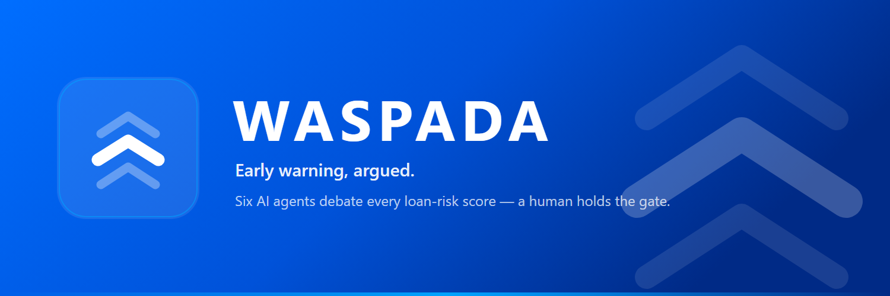

<div align="center">



### 预警而后决策，且可辩论

会辩论的贷款风险预警系统 — 六个 AI 智能体在人做出决定前，为每一个风险评分展开辩论。<br/>
<i>A six-agent AI society that debates every loan-risk score before a human decides.</i>

<p>
<a href="LICENSE"></a>


</p>

<p>
<a href="https://waspadaprod-api-vouqzqqkiu.ap-southeast-1.fcapp.run"><b>在线演示</b></a>
&nbsp;·&nbsp;
<a href="docs/wiki/Home.md"><b>工程文档 Wiki</b></a>
&nbsp;·&nbsp;
<a href="docs/HACKATHON.md"><b>设计与评分</b></a>
</p>

<a href="README.md">English</a> · <b>中文</b>

</div>

---

## 这是什么

**WASPADA** 为放贷机构的贷款账簿评分，让一个 **AI 智能体社会** 就风险最高的账户展开辩论，在有限的调用预算下自行化解分歧，最终交给人工分析师一份**有据可依的催收工作清单** —— 并附上完整的辩论记录。一套风险引擎，两个决策场景：

- **催收 / 早期预警（EWS）** —— 哪些存量账户即将滚入不良（NPL），以及如何分配有限的催收人力。**已端到端完成**（数据智能体 → 模型 → 辩论 → 排序 → 看板，附人工审批门）。
- **进件（Origination）** —— 对新申请做批准 / 复核 / 拒绝。作为同一引擎上的第二条附加通道**已完成**（WA-033..039）：独立的申请时点数据契约与特征、按申请队列的时序外推切分，以及一个由辩论裁决真正驱动的批准/复核/拒绝矩阵。

> **核心理念：一个能被质疑的评分，胜过一个无法质疑的评分。** 经典 PD 模型为 100% 的账簿评分；智能体社会审计一个分层切片，在与模型分歧处开启一场有界的辩论，由人守住最终的审批门。每一条主张都引用证据，每一次运行都留下审计轨迹。

## 六智能体社会

| 智能体 | 职责 | 脑力档位 |
|--------|------|----------|
| **数据工程师** | 从 OSS 载入账簿 → DuckDB 湖仓 + 数据质量检查 | flash |
| **数据分析师** | 构建特征帧 + 聚合（DuckDB SQL 探索） | plus |
| **精算师** | 经典 sklearn 模型评分，并在辩论中为自己的评分**辩护** | sklearn + plus |
| **怀疑者** | 审计分层切片，在独立判断分歧 ≥ 阈值处开启**争议** | flash |
| **仲裁者** | 阅读挑战与反驳，裁定 维持 / 推翻 / 升级 | max |
| **洞察** | 排序工作清单、计算组合健康度与告警、组装看板负载 | — |

外加**人工审批门（ApprovalGate）** —— 在边界性的降级与低置信裁决上，社会把最终决定权交还给人。

## 治理亮点

- **概率校准（WA-094）** —— 等渗后验校准，让 `p_default` 成为真实概率（保留 `explain()` 可解释性）。
- **漂移监控（WA-093）** —— 逐次运行的 AUC / Brier / 违约率 + 按特征的 PSI 群体稳定性指数，以「模型卡」呈现。
- **模型版本登记（WA-082）** —— 确定性的 `pd-lr-<sha>`，发布/加载至 OSS，每次决策可追溯到确切模型。
- **人工参数矩阵（WA-095）** —— 分析师在运行前设定策略（评级→动作矩阵、争议阈值、仲裁置信、审计数 K……），并以 `policy_id` 记录溯源。

## 快速开始（离线，无需凭据）

```bash
python -m venv .venv && . .venv/bin/activate     # Windows: .venv\Scripts\activate
pip install -r requirements.txt
# 端到端运行（合成数据，写出看板负载 + 审计日志）
python -m waspada.agents --lane collections --auto-approve
python -m waspada.agents --lane origination --auto-approve   # 第二条通道
pytest -q                                          # 545 项测试，离线全绿
```

看板：`cd dashboard && npm install && npm run dev`。API：`uvicorn api.main:app`。

## 技术栈

Alibaba Cloud OSS（数据湖）· DuckDB（进程内查询引擎）· 通过 DashScope 调用的 Qwen 模型（智能体社会的推理大脑，可选）· 可 Mock 的多智能体层（**默认离线**）· Simple Log Service（审计流）· ApsaraDB RDS MySQL（鉴权）· React / TypeScript 看板。

详见 [English README](README.md) 与 [工程文档 Wiki](docs/wiki/Home.md)。

---

<div align="center"><sub>为 Qwen Cloud（阿里云）黑客松而建 · MIT License</sub></div>
