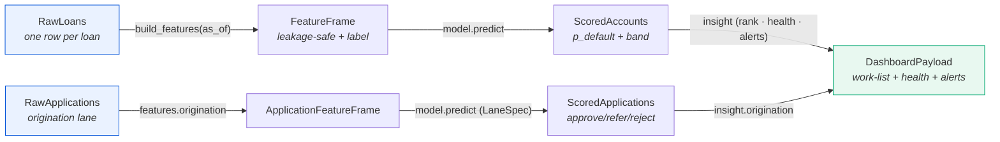
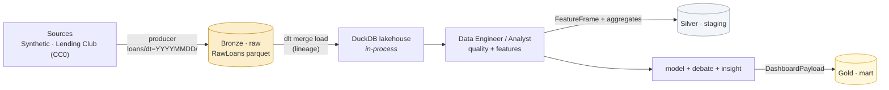

# Data Architecture

> Data is the foundation. WASPADA treats the data layer as a **frozen contract**
> plus a **medallion lakehouse** on Alibaba OSS, loaded through **dlt** into an
> in-process **DuckDB** the agents query.

## 1. The frozen data contract

Four dataclass-backed shapes in [`waspada/schema.py`](../../waspada/schema.py) are
the API between every layer. They never change shape non-additively — a new column
is fine, a renamed/removed one is a breaking change nobody is allowed to make
unilaterally.



| Shape | Role | Key fields |
|-------|------|-----------|
| `RawLoans` | one row per loan, as ingested | `loan_id`, `amount`, `rate`, `grade`, `dti`, `current_status`, … |
| `FeatureFrame` | model-ready, leakage-safe | the feature subset + `label_default` + `as_of_date` |
| `ScoredAccounts` | the model's output | `p_default`, `score_band`, `segment`, `recommended_action` (+ additive `final_band`, `top_driver`, `expected_loss`) |
| `DashboardPayload` | the frontend hand-off | `work_list`, `portfolio_health`, `alerts` (+ additive `agent_dialogue`, `model_card`, `policy_card`) |

`validate_table()` enforces each shape. It **allows supersets** — additive columns
(`final_band`, `override_reason`, `expected_loss`, `top_driver`) flow through
without breaking the contract. That additive discipline is what lets features land
incrementally without a coordinated schema migration.

### The leakage guard

Only a **leakage-safe subset** of the FeatureFrame enters the model matrix
(`FEATURE_COLUMNS`). `label_default` (the label), `delinquency_status` (derived
from the outcome), `as_of_date` (metadata), and `loan_id` (identifier) are
explicitly excluded (`LEAKAGE_EXCLUDED`) and pinned by a test. See
[ML Governance](09-ml-governance.md).

## 2. The medallion lakehouse (OSS)



Three OSS buckets, the classic **Bronze / Silver / Gold** tiers:

| Tier | Bucket | Contents | Written by |
|------|--------|----------|-----------|
| **Bronze (Raw)** | `…-raw` | the ingested `RawLoans` Parquet | the producer / upstream |
| **Silver (Staging)** | `…-staging` | derived `FeatureFrame` + analyst aggregates | Data Analyst (WA-090) |
| **Gold (Mart)** | `…-mart` | the assembled `DashboardPayload` | Insight (WA-090) |

### Date partitioning

Objects are **date-partitioned** by an owner convention:

```
loans/dt=<YYYYMMDD>/loans.parquet
```

`YYYYMMDD` sorts lexicographically == chronologically, so "the latest snapshot" is
a plain `max()` over the partition keys — no metadata store required. The
**partition resolver** (`waspada/data/oss.py`, WA-047) lists a prefix and picks the
newest `dt=` partition (or a pinned `OSS_AS_OF`), with a flat-object fallback for
back-compat.

## 3. The load path: dlt → DuckDB

The Data Engineer builds a **DuckDB lakehouse** the quality tools query in-process
(no warehouse round-trip). Two paths, chosen by `WASPADA_USE_DLT`:

- **dlt path** (WA-083, opt-in): `waspada/data/lakehouse.py::load_via_dlt` runs an
  actual **dlt pipeline** — `write_disposition="merge"` + `primary_key="loan_id"`
  (idempotent re-loads), a `schema_contract` (data-type freeze), and `_dlt_loads`
  **lineage** (load_id + rows) surfaced on `Lakehouse.lineage` so the Data Engineer
  can cite freshness/provenance as debate evidence.
- **Arrow path** (default): an in-memory DuckDB registration of the Arrow table —
  the offline, network-free path tests use.

> DuckDB gotcha baked into the code: the catalog (db-file basename) **must differ**
> from the dataset name (`waspada_lakehouse.duckdb` vs dataset `lakehouse`) or the
> binder raises *"Ambiguous reference to catalog or schema."*

## 4. Pluggable data sources (WA-089)

`waspada/data/sources.py` abstracts *where* `RawLoans` comes from behind
`RawLoansSource`:

- **SyntheticSource** — the deterministic offline generator (tests, demos).
- **LendingClubSource** — a real, legal-clean public dataset (CC0 / public domain).

`get_source()` resolves by arg → `WASPADA_DATA_SOURCE` env → synthetic default.
Every source `fetch()` validates against `RawLoans`, so the rest of the pipeline is
source-agnostic. The **producer** (`python -m waspada.data.producer`) runs
source → OSS Raw partition.

## 5. Design principles

- **Contract-first**: agents exchange the four frozen shapes, never ad-hoc dicts.
- **Additive-only** evolution — supersets validate, so features ship incrementally.
- **Offline-safe**: every OSS/dlt path has a guarded fallback; no network in tests.
- **Provenance**: dlt `_dlt_loads`, date partitions, and the model/policy cards make
  every number traceable to its source and the version that produced it.

**Related:** [System Architecture](02-system-architecture.md) ·
[Alibaba Cloud Infra](07-alibaba-cloud-infra.md) · [ML Governance](09-ml-governance.md)
