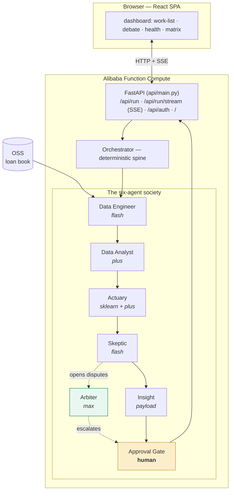

# System Architecture

> A deterministic spine orchestrating a society of AI agents, served by a FastAPI
> backend and a React dashboard, running on Alibaba Cloud.

## 1. The big picture

## 2. The six-agent society

The society is the product's differentiator: not one model, but a **division of
cognitive labour** where agents check each other.

| Agent | Role | Brain tier | What it does |
|-------|------|-----------|--------------|
| **Data Engineer** | ingest + lakehouse | flash | Loads `RawLoans` from OSS → DuckDB lakehouse; runs data-quality tool loop |
| **Data Analyst** | features + aggregates | plus | Builds the `FeatureFrame` + `analyst_aggregates` (DuckDB SQL exploration) |
| **Actuary** (`risk_model`) | classical scoring | sklearn + plus | Trains/loads the PD model, scores 100% of the book, **defends** its scores in debate |
| **Skeptic** (`risk_auditor`) | audit + challenge | flash | Audits a stratified slice; opens a **dispute** where its view diverges ≥ gap |
| **Arbiter** | adjudication | max | Reads challenge + rebuttal, rules `uphold` / `override` / `escalate` |
| **Insight** | assembly | — | Ranks the work-list, computes portfolio health + alerts, assembles the payload |

Plus the **human `ApprovalGate`** — the society defers to a person on borderline
de-escalations and low-confidence rulings.

The debate itself (challenge → rebuttal → ruling) is covered in
[Debate Mechanism](04-debate-mechanism.md); the agent framework in
[Harness Architecture](03-harness-architecture.md).

## 3. The orchestrator — a deterministic spine

[`waspada/agents/orchestrator.py`](../../waspada/agents/orchestrator.py) is **not**
an agent — it's deterministic control flow. It:

1. Plans the lane's step order (`COLLECTIONS_STEP_ORDER`).
2. Runs each agent, threading artifacts through an `AgentContext.data_handles` map.
3. Between the Skeptic and Insight, **resolves every open dispute** through the
   3-round debate (rebuttal → arbiter → gate).
4. Applies **adjudications** back to the work-list (WA-048) as additive columns.
5. Records every hop as a `Handoff` and every action as a step-log entry.

Why deterministic? Because a *reproducible, auditable* pipeline is the governance
story. The LLM non-determinism is quarantined inside individual agent reasoning;
the flow between them is code.

## 4. Two lanes

- **Collections** (built): the early-warning / work-list lane this wiki documents.
- **Origination** (built, `WA-033…039`): the second lane — approve/refer/reject
  new applications on the **same engine and society**. Its own application-time
  contract (`RawApplications` → `ApplicationFeatureFrame` → `ScoredApplications`),
  feature recipe, out-of-time application-cohort model split, and an
  approve/refer/reject decision matrix the debate's rulings actually move — while
  the orchestrator, debate, gate, and dashboard machinery run **verbatim** (an id
  alias keeps them lane-agnostic). `python -m waspada.agents --lane origination`
  runs the whole society end-to-end offline. Label honesty: the source has funded
  loans only, so the label is *funded-then-defaulted* — no reject-inference is
  claimed.

## 5. The API layer

[`api/main.py`](../../api/main.py) — FastAPI on Function Compute:

- `POST /api/run` — runs the whole pipeline, returns `{payload, report, steps}`.
  Accepts an optional per-run **parameter matrix** (`{"policy": {...}}`, WA-095).
- `GET /api/run/stream` — **SSE** stream of debate rounds/resolutions as they
  happen (the live "watch the society argue" view, WA-022).
- `POST /api/auth/*` — JWT auth (RDS MySQL-backed).
- `GET /` — serves the built React SPA (via `HTMLResponse` so the browser renders
  it rather than downloading).

Data is always read from **real OSS**; `brain=mock|qwen` selects only the reasoning
LLM. Auth-gated routes attach a Bearer token; a bad token returns to the login gate.

## 6. The dashboard

A React 18 + Vite + TypeScript SPA ([`dashboard/`](../../dashboard/)), **zero UI
framework** — hand-rolled components on a token-driven design system
(`styles/tokens.css`). Bilingual EN / 简体中文. Panels: work-list (with driver
chips), portfolio health, alerts, the **debate flow-chart** + transcript, the
**Human Gate** panel, the **Model Card**, and the **Parameter Matrix** editor.

## 7. Where it runs

FastAPI in a custom-container **Function Compute** function, image in **ACR**, data
in **OSS**, auth in **RDS MySQL**, audit stream to **SLS**, all provisioned by
OpenTofu/Terraform. See [Alibaba Cloud Infra](07-alibaba-cloud-infra.md).

**Related:** [Harness Architecture](03-harness-architecture.md) ·
[Debate Mechanism](04-debate-mechanism.md) · [Data Architecture](01-data-architecture.md)
