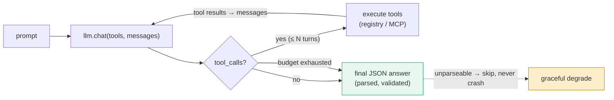

# Harness Architecture

> The agent framework — how an "agent" is defined, how it reasons, how it calls
> tools, and how a human stays in control. This is the reusable machinery the
> [debate](04-debate-mechanism.md) and the [society](02-system-architecture.md)
> are built on.

## 1. The `Agent` base

Every agent extends `Agent` ([`waspada/agents/base.py`](../../waspada/agents/base.py)):

- `run(context: AgentContext) -> AgentResult` — the one method the orchestrator
  calls. Reads its predecessor's artifact from `context.data_handles`, does its
  work, writes its own artifact back, returns a status.
- `register_tool(key, fn)` / `self.tools.get(key, default)` — a tiny tool registry.
  Tools are plain callables (e.g. the Data Engineer's `fetch`, the Skeptic's
  `portfolio_stats` / `lookup_account`), swappable for MCP-backed implementations.
- `step(action, *, status, notes)` — appends to the **audit step log**. Every
  meaningful action is recorded, so a run is fully reconstructable after the fact.

`AgentContext` carries `lane`, a `data_handles` dict (the artifact bus), and
`meta` (run_id, source). `AgentResult` carries `status` (`OK` / `ERROR` /
`BLOCKED` / `DISPUTED`), the `artifact_ref` (which handle it published), and notes.

## 2. The LLM surface

[`waspada/agents/llm.py`](../../waspada/agents/llm.py) is a thin, mockable wrapper
with **two implementations behind one interface**:

| | `MockLLM` | `QwenLLM` |
|---|-----------|-----------|
| Network | none | Alibaba DashScope (OpenAI-compatible) |
| Use | tests, offline, demo | live reasoning |
| Determinism | total (canned or scripted) | model-dependent |

Two calling surfaces:

- `complete(prompt) -> str` — the legacy string-in/string-out path; agents that
  need structured output parse JSON from the string.
- `chat(prompt, *, tools, messages) -> ChatResponse` — the **native function-calling**
  surface (WA-041). When `tools` are supplied and the backend supports it, the
  model emits real OpenAI `tool_calls`; the agent executes them and feeds results
  back over `messages` in a bounded loop.

A capability flag `supports_native_tools` lets an agent pick the native-vs-legacy
path **without consuming a scripted reply** — important for deterministic tests.
Model tiering (`flash` / `plus` / `max`) is via `with_model()`; on `MockLLM` it's a
no-op label, on `QwenLLM` it clones the client onto a different model id. See
[LLM / Qwen](08-llm-qwen-model.md).

## 3. The reasoning loop

Agents that reason (Data Engineer, Data Analyst, Skeptic) run a **bounded tool-loop**:

The loop is **bounded** (`_MAX_TOOL_TURNS`) so cost is deterministic, and it
**degrades gracefully** — an unparseable reply or an unreachable brain skips the
account rather than crashing the run.

## 4. Tools & MCP

Tools default to in-process stubs that read the in-memory Arrow/DuckDB tables. They
can be **rebound to an MCP client** (`attach_mcp`) — an in-process client (same
store, no subprocess) or a stdio subprocess (a real protocol round-trip). The
Skeptic's `portfolio_stats` / `lookup_account` evidence tools are the primary MCP
surface; the analyst's aggregates feed them.

## 5. The human in the loop — `ApprovalGate`

The `ApprovalGate` is where the society **defers to a person**:

- **interactive** (default): a `decide` callable approves/rejects (the real human).
- **auto-approve** (`WASPADA_AUTO_APPROVE=1` / API default): short-circuits to
  approve but flags the step `auto=True`, so the audit trail is honest about it.

The gate is consulted before the work-list is released and on **de-escalations**
(when the society wants to *cancel* a collector call — worst case is a missed
default, so a human confirms). The read-only "what got escalated" surface is the
dashboard's **Human Gate** panel; a live approve/reject queue is the WA-097
follow-up.

## 6. Determinism & testing philosophy

The harness is engineered so the **entire system runs offline, deterministically**:

- `MockLLM` (canned or scripted) replaces the network.
- Every OSS / dlt / SLS / Qwen path has a **guarded fallback** — absent config, the
  code takes the offline branch and behaves byte-for-byte as before.
- Parallelism (the WA-080 concurrent audit) is **opt-in** and only enabled for the
  thread-safe Qwen client; the scripted mock stays sequential.

Result: a 530+ test suite runs green with no credentials, no network, no GPU — and
the same code path lights up live on Qwen when configured.

**Related:** [Debate Mechanism](04-debate-mechanism.md) ·
[System Architecture](02-system-architecture.md) · [LLM / Qwen](08-llm-qwen-model.md)
