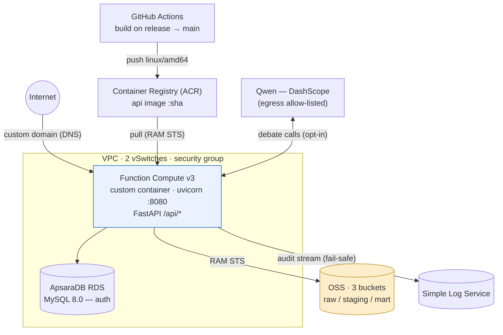

# Alibaba Cloud Infrastructure

> WASPADA runs entirely on **Alibaba Cloud**, provisioned as code with
> **OpenTofu / Terraform** in [`deploy/iac/`](../../deploy/iac/). This page maps the
> services and how they fit together. (WASPADA does **not** use GCP/AWS — a stray
> `.gcloudignore` from an early experiment was removed.)

## 1. Topology

## 2. Services (from the IaC)

| Terraform resource | Service | Role |
|--------------------|---------|------|
| `alicloud_oss_bucket` ×3 (+ ACLs) | **OSS** | the medallion lake — `…-raw` / `…-staging` / `…-mart` |
| `alicloud_fcv3_function` | **Function Compute v3** | the FastAPI backend (custom-container, port 8080) |
| `alicloud_fcv3_custom_domain` + `alicloud_alidns_record` | **FC domain + DNS** | the public URL |
| `alicloud_fcv3_trigger` | **FC trigger** | the HTTP trigger (and the batch time-trigger path, WA-088) |
| `alicloud_db_instance` + `alicloud_db_database` + `alicloud_rds_account` + `alicloud_db_account_privilege` | **RDS MySQL 8.0** | the auth store (users, JWT) |
| `alicloud_log_project` + `alicloud_log_store` | **Simple Log Service** | the queryable audit stream (WA-023) |
| `alicloud_ram_role` + `alicloud_ram_policy` ×3 + attachments ×6 | **RAM** | the FC execution role — STS-scoped OSS/SLS/ACR access |
| `alicloud_vpc` + `alicloud_vswitch` ×2 + `alicloud_security_group` | **VPC** | the private network the function + RDS sit in |

IaC files: `main.tf` (core), `custom_domain.tf`, `rds_grant.tf`, `variables.tf`,
`outputs.tf`, `versions.tf`.

## 3. The compute — Function Compute

- **Custom container** (not a runtime): the backend ships as an image, so the exact
  Python + deps are pinned.
- **Port 8080**, `uvicorn api.main:app`, health check on `/api/health`.
- **ACR** hosts the image; the FC execution **RAM role** grants pull access via STS.
- **`acceleration_type` removed**: the provider marks it deprecated so it never
  converges; the real "PullImageFailed" fix was stamping the image **linux/amd64**
  in the build workflow, not the flag.
- **Image tag** is pinned by SHA on release for reproducible deploys.

## 4. Data — OSS (three buckets)

The [medallion](01-data-architecture.md#2-the-medallion-lakehouse-oss): `raw`
(Bronze), `staging` (Silver), `mart` (Gold). FC reads via the **internal VPC
endpoint** when set (`coalesce(var.oss_endpoint_internal, "oss-ap-southeast-1.aliyuncs.com")`)
to avoid data-transfer charges; falls back to the public endpoint otherwise.

> Local-dev gotcha: the `.env` often carries the `-internal` endpoint, which is
> **unreachable from a laptop** — use the public `oss-ap-southeast-1.aliyuncs.com`
> for local testing.

## 5. Auth — RDS MySQL

A small RDS MySQL 8.0 instance backs JWT auth. The IaC provisions the instance, a
database, an account, and the grant (`rds_grant.tf`). The API uses `pymysql`.

## 6. Audit — SLS

Every run ships its step-log to **Simple Log Service** (WA-023) — a queryable audit
stream. It's **fail-safe**: if SLS is unconfigured or down, records fall back to a
local JSONL file, so a run never fails because audit couldn't ship.

## 7. Secrets & identity

- **RAM roles + STS**: FC assumes an execution role scoped to exactly the OSS/SLS/ACR
  actions it needs — no long-lived keys baked into the function.
- Hardening path (WA-087): move remaining plaintext `.env` creds into **KMS Secrets
  Manager** + RAM-role STS for OSS.

## 8. Deploy flow

1. `git push origin … → main` triggers the GitHub Actions image build → pushes to ACR
   (`:latest`, `:v2`, `:<sha>`).
2. `tofu apply -replace=alicloud_fcv3_function.api -var-file=secrets.tfvars` rolls FC
   onto the new image (a full replace keeps the same URL and cycles the warm
   instance, which an in-place image update does not).
3. Verify: `/api/health` → `{"status":"ok"}`, and the dashboard renders at the URL.

## 9. Batch refresh (designed — WA-088)

A **FC Time Trigger** (cron) runs the producer to land a fresh `RawLoans` partition
in OSS on a schedule, so the dashboard always scores a current snapshot without a
standing server.

**Related:** [Data Architecture](01-data-architecture.md) ·
[System Architecture](02-system-architecture.md) · [Tech Stack](05-techstack.md)
