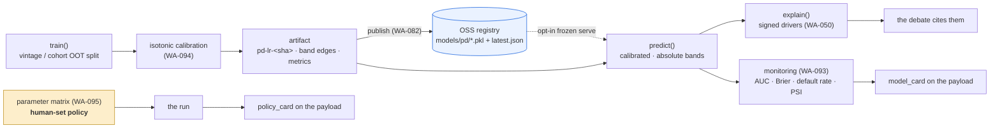

# ML Governance

> The classical PD model and everything that keeps it **honest, calibrated,
> monitored, versioned, and under human control**. WASPADA's thesis is that a
> governed model a society can argue with beats a black box — this page is the
> governance half of that.

## 0. The governance loop at a glance

## 1. The PD model

The **Actuary** is a scikit-learn `LogisticRegression`
([`waspada/model/risk.py`](../../waspada/model/risk.py)) predicting
**P(eventual charge-off / default)**:

- **Pipeline**: `StandardScaler` (numerics) + `OneHotEncoder` (categoricals) + L2
  logistic regression, on the **leakage-safe** `FEATURE_COLUMNS` only.
- **Vintage split**: trains on *older* origination cohorts, tests on *newer* — an
  out-of-time check, not a random split. Reconstructs the cohort year from
  `loan_age` + `as_of_date` (the FeatureFrame has no `issue_date`).
- **Fit-per-run** by default: the model retrains each run on the incoming book, so
  there is **no stale-model drift** — but see §3 for what *does* need watching.

> The GPU path (cuDF/cuML) is declared but on hold; the active + deployed path is
> **CPU sklearn** (`api/requirements.txt` is CPU-only). Swapping in cuML later is a
> drop-in — `train`/`predict` keep their signatures.

## 2. Explainability — `explain()` (WA-050)

`explain(model, features, loan_id)` returns the **signed logit contributions**
behind one account's score (`coef · x` on the transformed features). Because the
model is linear, `intercept + Σ contributions == logit(p_default)` — the score is
*fully decomposed, not approximated*. This is what lets the Actuary defend its
*actual reasoning* in the [debate](04-debate-mechanism.md) and what powers the
work-list's **"why this row" driver chip** (`dti=31.20 ↑`).

## 3. Calibration (WA-094)

`class_weight="balanced"` improves the fit but **distorts the probabilities** toward
0.5 — yet `p_default` is consumed as a *real* probability (expected loss, absolute
bands). So a **post-hoc isotonic calibrator** is fit on the hold-out:

- The LR pipeline is **untouched** → `explain()` and its coefficients are unchanged;
  calibration is a *monotone remap* of the final probability, so ranking (and AUC)
  are preserved and only the values are corrected.
- One scoring path (`_calibrated_proba`) — `predict()` and the band edges both go
  through it, so bands sit on the *served* probability.
- **Guarded**: fits only on a ≥30-row two-class hold-out; else raw (tiny/offline
  frames byte-identical). Reported via `brier_raw` → `brier_calibrated`.

## 4. Banding — absolute, not relative (WA-051)

Bands were per-batch quintiles ("Very High" = top 20% of *this* run), which makes
**covariate shift invisible** — the band mix never moves even when the book gets
riskier. WASPADA freezes **absolute PD band edges** from a reference distribution,
so the band distribution moves when the portfolio does. That's the single change
that makes drift *visible* on the dashboard.

## 5. Monitoring & drift (WA-093)

[`waspada/model/monitoring.py`](../../waspada/model/monitoring.py) — a per-run,
JSON-serialisable **model card**:

- **Metrics**: hold-out AUC, Brier (raw + calibrated), observed default rate
  (`mean(label_default)`), train/test sizes + split method, served band mix.
- **PSI** (Population Stability Index) per feature vs a reference cohort — numeric
  (binned) + categorical (category-frequency). Flags at **0.2** (moderate) / **0.25**
  (significant) with the top-drifted features.

The card rides the payload (`model_card`) and renders as the dashboard's **Model
Card** strip (AUC / default rate / Brier / band-mix bar / drift flag / model id).

## 6. Versioning — the model registry (WA-082)

[`waspada/model/registry.py`](../../waspada/model/registry.py) makes scoring
**reproducible + auditable** — *"this run scored with `pd-lr-<id>`, trained as-of T,
AUC=Y"*:

- `model_id()` — a deterministic `pd-lr-<sha>` over the coefficients + intercept +
  feature list + band edges + calibrator thresholds.
- `publish_model()` / `load_published_model()` — write the versioned pickle +
  `latest.json` manifest to OSS (via the WA-047 write path); load `latest` or a
  pinned id.
- **Opt-in frozen serve** in the Actuary (`WASPADA_PD_MODEL_SOURCE=oss`) — score with
  a frozen versioned model instead of re-fitting; **default off** → train per-run.
- `python -m waspada.model.publish` — the train-offline entrypoint (CI/manual, not
  per-request). Stays **in-process ($0, no PAI-EAS)** — see `backlog/pd-model-hosting.md`.

## 7. The parameter matrix — human control (WA-095)

The governance surface a human sets **before a run** — the policy the whole society
plays by:

| Knob | Governs |
|------|---------|
| band → action grid | which risk band triggers call / watch / auto-cure |
| `dispute_gap` | how far the Skeptic must diverge to open a dispute |
| `arbiter_confidence` | the Arbiter's escalation threshold |
| `audit_k` | how many accounts the Skeptic audits |
| `top_n` | the work-list cap |
| `npl` / `vintage` thresholds | the cohort-deterioration alert cutoffs |

- `RiskPolicy` ([`waspada/policy/`](../../waspada/policy/)) holds the matrix;
  `policy_from_dict()` builds + **validates** it (a bad matrix can't wedge a run);
  `policy_id()` gives deterministic provenance.
- Submitted **per-run** via `POST /api/run` `{"policy": {...}}` (invalid → 400);
  threaded through the orchestrator → auditor / arbiter with precedence
  **explicit-arg > policy > default**; and stamped on the payload as `policy_card`
  so every decision cites the exact matrix that governed it.
- Edited in the dashboard's **Parameter Matrix** panel → "Run with this matrix".

## 8. Leakage guard

The single most important invariant: only `FEATURE_COLUMNS` enter the model.
`label_default`, `delinquency_status`, `as_of_date`, `loan_id` are in
`LEAKAGE_EXCLUDED` and pinned by `test_model.py::test_no_outcome_leakage_in_features`.

---

Together these give WASPADA a real governance story: **calibrated** probabilities,
**explainable** scores, **monitored** drift, **versioned** models, and a
**human-set policy** — every decision traceable to the model *and* the matrix that
produced it.

**Related:** [Debate Mechanism](04-debate-mechanism.md) ·
[Data Architecture](01-data-architecture.md) · [System Architecture](02-system-architecture.md)
